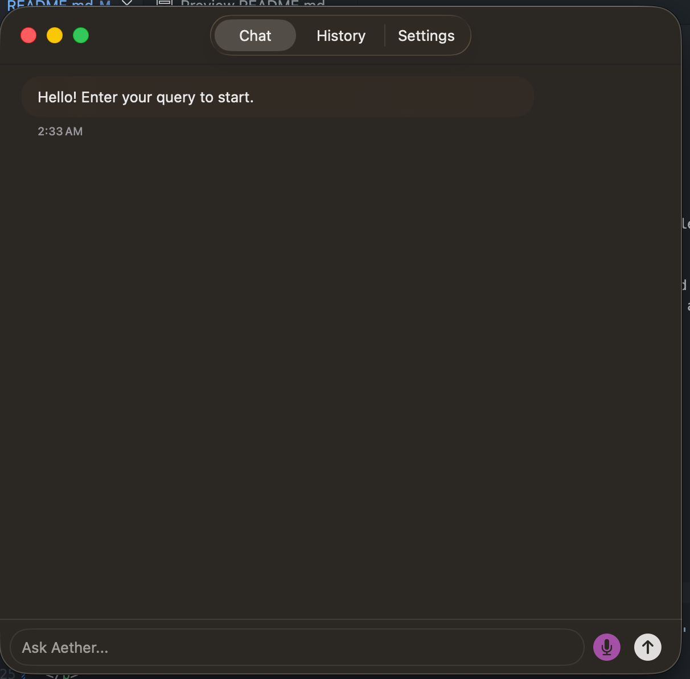
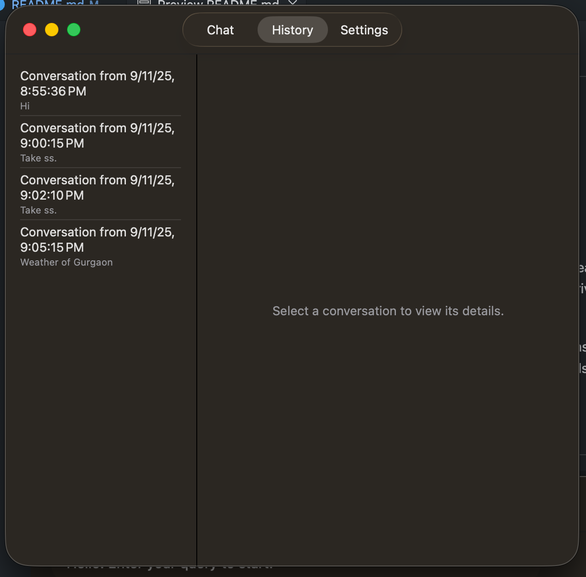
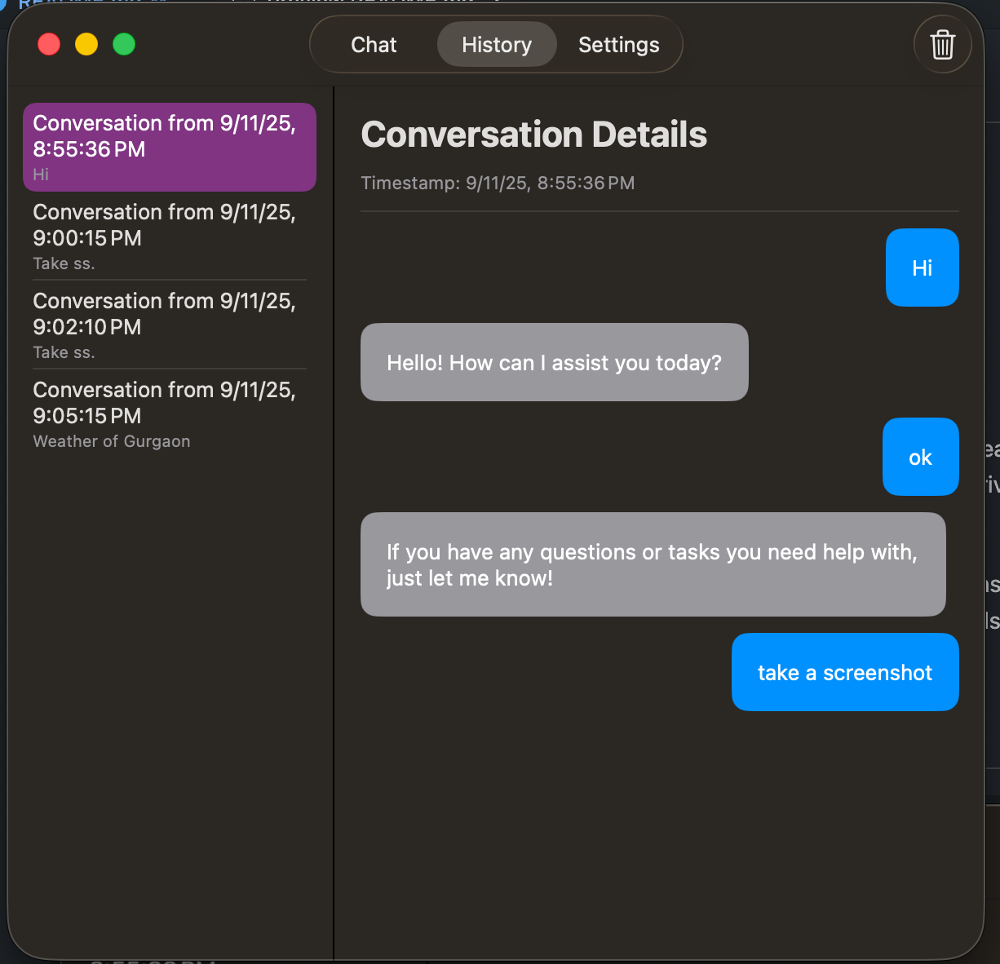
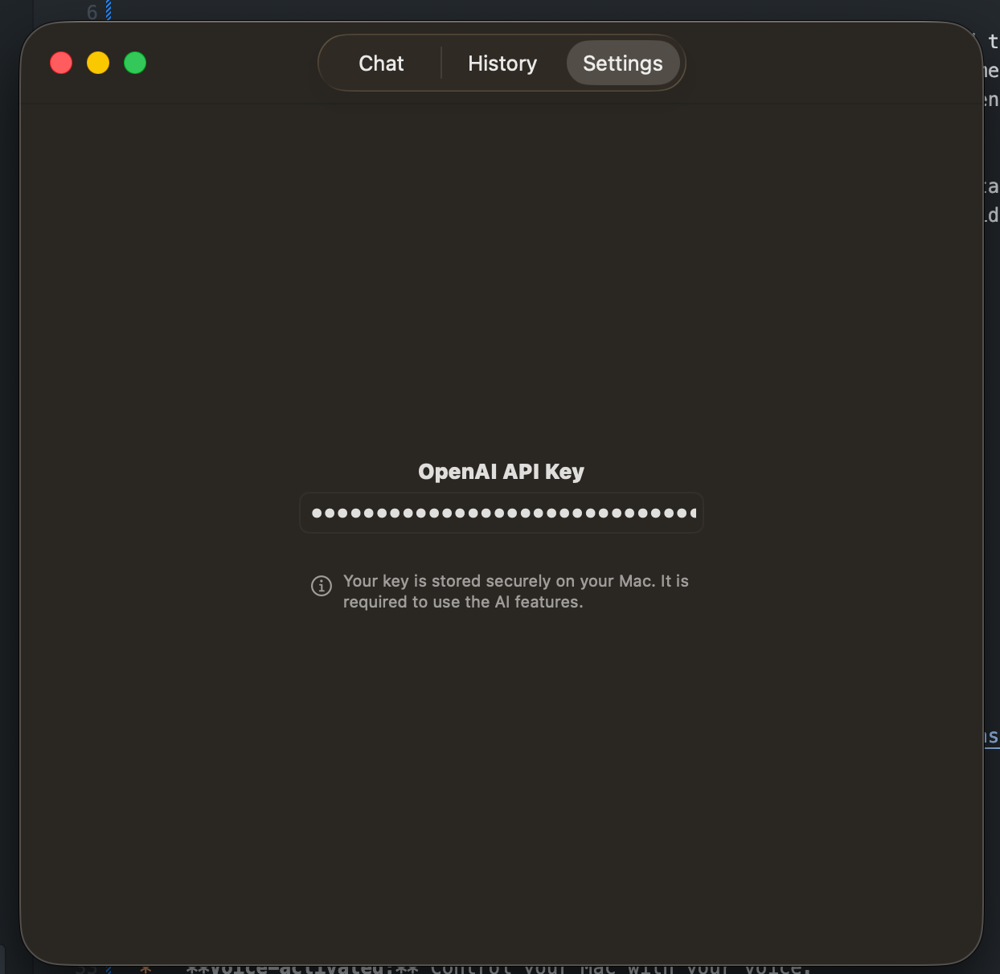

# MacAssist

  

MacAssist is a powerful, open-source voice assistant for macOS, designed to integrate seamlessly into your workflow. Powered by a sophisticated AI named **Aether**, MacAssist is built to be a private, efficient, and highly extensible assistant.

Aether is designed to run locally on your machine, ensuring that your data and interactions remain private. The application is built with SwiftUI, providing a clean and modern user interface that feels right at home on macOS.

## Table of Contents

- [Screenshot](#screenshot)
- [Features](#features)
- [Getting Started](#getting-started)
- [Usage](#usage)
- [Contributing](#contributing)
- [License](#license)

## Screenshot

  
  
  
  

## Features

- **Voice-activated:** Control your Mac with your voice.
- **Local AI:** All processing is done on your device, ensuring privacy and speed.
- **Extensible:** Easily add new commands and integrations.
- **SwiftUI Interface:** A clean and modern user interface.
- **Open Source:** Contribute to the development of MacAssist.

## Getting Started

To get started with MacAssist, you'll need to have Xcode installed on your Mac.

1.  Clone the repository: `git clone https://github.com/aman-senpai/MacAssist.git`
2.  Open the project in Xcode: `open MacAssist.xcodeproj`
3.  Build and run the project.

## Usage

To use MacAssist, simply press the hotkey and speak your command. For example, you can say "Open Safari" or "What's the weather today in Gurgaon?".

## Contributing

Contributions are welcome! If you'd like to contribute to MacAssist, please follow these steps:

1.  Fork the repository.
2.  Create a new branch for your feature or bug fix.
3.  Make your changes and commit them.
4.  Push your changes to your fork.
5.  Create a pull request.

### Adding a New Command

New commands are implemented as "tools". To add a new command, you'll need to:

1.  **Define a new tool:** Create a new class that conforms to the `ToolProtocol`.
2.  **Implement the `execute` method:** This method will contain the logic for your new command.
3.  **Add the tool to the `ToolExecutionManager`:** This will make the tool available to the application.
4.  **Add a tool schema to `AetherAgent.swift`:** This will allow the AI to understand and use your new command.

For an example of how to implement a tool, see the `SystemTools.swift` file.

### Project Architecture

The project is divided into the following directories:

- **Application:** Contains the main application logic.
- **Assets.xcassets:** Contains the application's assets, such as icons and images.
- **Core:** Contains the core components of the application, such as models and services.
- **Logic:** Contains the business logic of the application, such as managers and view models.
- **Tools:** Contains the tools that the AI can use to perform actions.
- **UI:** Contains the user interface of the application, such as views and components.

### Dependencies

The project uses the following Apple frameworks:

- **SwiftUI:** For the user interface.
- **AppKit:** For native macOS controls.
- **Foundation:** For core data types and services.
- **Combine:** For reactive programming.
- **Speech:** For speech recognition.
- **AVFoundation:** For audio playback.
- **Carbon:** For low-level system events.

The project has no external dependencies.

## Roadmap

- **✅ LLM Agnostic:** MacAssist now supports multiple LLM providers:
  - **OpenAI** - GPT-4 and later models
  - **Google Gemini** - Gemini 1.5 Pro and Flash
  - **Ollama** - Run local models (llama3.1, mistral, etc.)
- **Support for more languages:** Add support for languages other than English.
- **Plugin system:** Allow developers to create and share plugins that add new features to MacAssist.
- **Improved UI:** Continue to improve the user interface and user experience.
- **More tools:** Add more tools to the AI's arsenal.

## Contact

- **Email:** aman.senpai@outlook.com
- **X:** [@AmanSenpai](https://x.com/amansenpai)
- **GitHub:** [aman-senpai](https://github.com/aman-senpai)

## Acknowledgments

- Thanks to the open-source community for providing the tools and resources to make this project possible.

## Disclaimer

This project is still in development and may not be stable. Use at your own risk.

## Support

If you need help with the project, you can:

- **Open an issue on GitHub:** [https://github.com/aman-senpai/MacAssist/issues](https://github.com/aman-senpai/MacAssist/issues)
- **Email the developers:** aman.senpai@outlook.com

## FAQ

**Q: Is MacAssist free?**

A: Yes, MacAssist is free and open-source.

**Q: What languages does MacAssist support?**

A: Currently, MacAssist only supports English. We plan to add support for more languages in the future.

**Q: Can I contribute to MacAssist?**

A: Yes, we welcome contributions! Please see the "Contributing" section for more information.

## Privacy Policy

MacAssist is designed to be a private and secure application. All processing is done on your device, and your data is never sent to the cloud.

We do not collect any personal information from our users.

## Code of Conduct

We are committed to providing a friendly, safe and welcoming environment for all, regardless of gender, sexual orientation, disability, ethnicity, religion, or similar personal characteristic.

Please be kind and respectful to others. We will not tolerate any form of harassment or discrimination.

## Security

If you discover a security vulnerability, please report it to us by emailing aman.senpai@outlook.com. We will investigate the issue and take appropriate action.

## Release History

- **0** - Initial release

## Credits

- **aman-senpai:** Project lead and developer

## Show your support

Give a ⭐️ if this project helped you!

## Authors

- **aman-senpai** - _Initial work_ - [aman-senpai](https://github.com/aman-senpai)

See also the list of [contributors](https://github.com/aman-senpai/MacAssist/contributors) who participated in in this project.

## Contributing

Please read [CONTRIBUTING.md](CONTRIBUTING.md) for details on our code of conduct, and the process for submitting pull requests to us.

## Built With

- [Swift](https://swift.org/) - The programming language used.
- [SwiftUI](https://developer.apple.com/xcode/swiftui/) - The UI framework used.
- [Xcode](https://developer.apple.com/xcode/) - The IDE used.
- **LLM Providers:**
  - [OpenAI](https://openai.com/api/) - GPT models support
  - [Google Gemini](https://ai.google.dev/) - Gemini models support
  - [Ollama](https://ollama.ai/) - Local model support

## Prerequisites

- macOS 26.0 or later
- Xcode 26.1.1. or later

## Installation

1.  Clone the repository: `git clone https://github.com/your-username/MacAssist.git`
2.  Open the project in Xcode: `open MacAssist.xcodeproj`
3.  Build and run the project.

## Testing

To run the tests for this project, you will need to have Xcode installed on your Mac.

1.  Open the project in Xcode.
2.  Go to "Product" > "Test".

## Known Issues

- There are no known issues at this time.

## Troubleshooting

- If you are having trouble with the hotkey, make sure that you have granted the necessary accessibility permissions in System Settings.
- If you are having trouble with speech recognition, make sure that you have granted the necessary microphone and speech recognition permissions in System Settings.

#### Added

- Initial release

## License

This project is licensed under the MIT License - see the [LICENSE](LICENSE) file for details.

## Project Status

This project is currently in **alpha**. It is not yet ready for production use.

## Star History

## Examples

- "Open Safari"
- "What's the weather today?"
- "Set a timer for 10 minutes"
- "Write an email for 5 days leave"

## API Reference

This project does not have an API.

## To-Do

- [ ] Add support for more languages
- [ ] Add a plugin system
- [ ] Improve the UI
- [ ] Add more tools

## Terms of Use

By using this project, you agree to the following terms of use:

- This project is for educational purposes only.
- The author is not responsible for any damage caused by this project.
- Use at your own risk.

## Say Thanks

- Tweet about this project
- Star this project on GitHub

## About the Author

**aman-senpai** is a product engineer with a passion for open-source projects. He is the creator of MacAssist and is always looking for new ways to improve the project.

- **GitHub:** [aman-senpai](https://github.com/aman-senpai)
- **X:** [@AmanSenpai](https://x.com/amansenpai)
- **LinkedIn:** [aman-senpai](https://www.linkedin.com/in/aman-senpai)

## Sitemap

- [Home](README.md)
- [Contributing](CONTRIBUTING.md)
- [Code of Conduct](CODE_OF_CONDUCT.md)
- [License](LICENSE)
